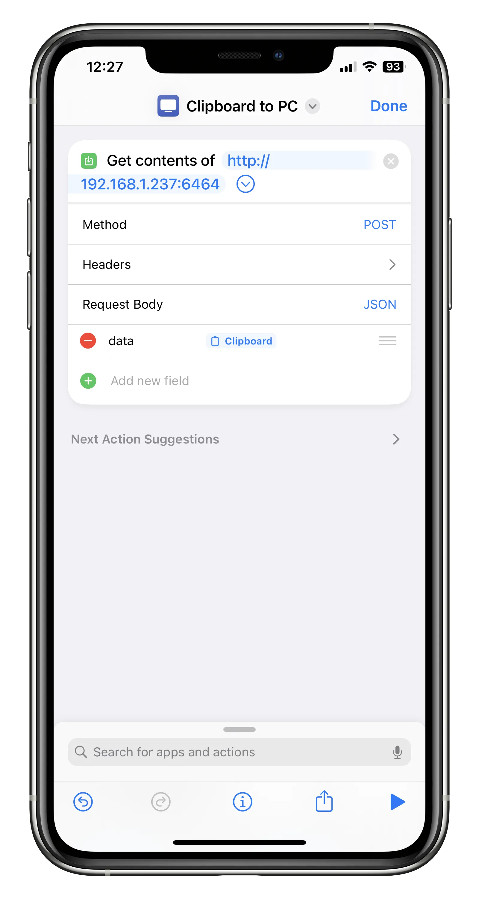

# pc-clipboard-api
我懶得每次傳連結和驗證碼到電腦都需要打開某個聊天軟體
I'm too lazy to open a chat app to send a link or a verification code to my computer every time.

## Usage

### 1. Install dependencies
```bash
npm install express clipboardy
```

### 2. Run server
```bash
node server.mjs
```

### 3. Send a request

Now, your Node.js server is running on port 6464. You can send POST requests to it, and the server will copy the received data into the clipboard.

Example POST request using `curl`:

```bash
curl -X POST -H "Content-Type: application/json" -d '{"data": "Hello, server!"}' http://localhost:6464
```

## Example usage with Shortcuts

You can use the [Shortcuts](https://apps.apple.com/us/app/shortcuts/id915249334) app on iOS to send a request to the server.

[Example shortcut](https://www.icloud.com/shortcuts/29c58dc0d34947a8b6f83f56a4ca6fdc)

